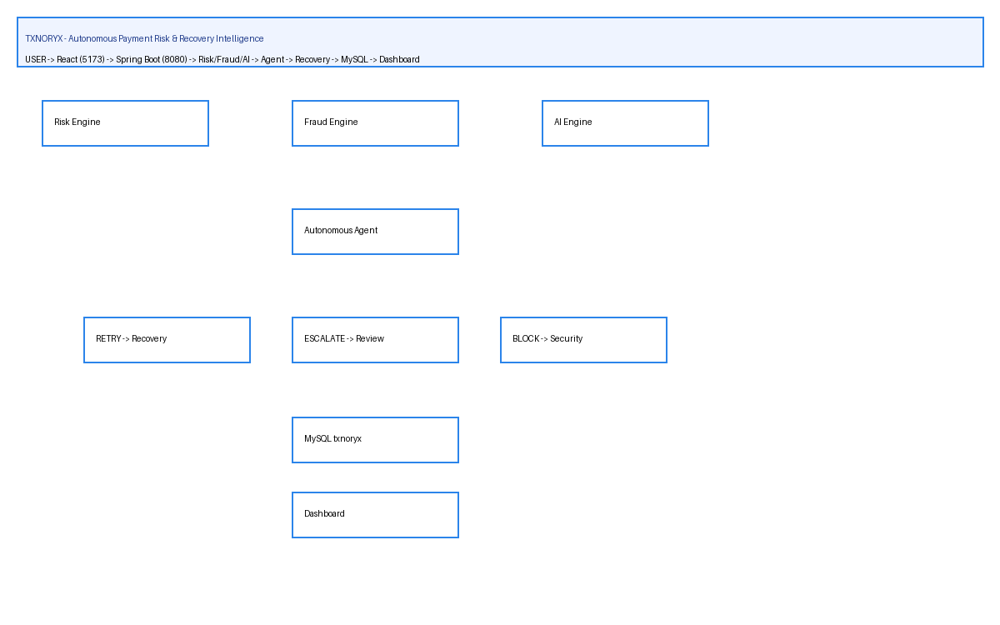

# TXNORYX — Autonomous Payment Risk & Recovery Intelligence

## Problem
Payment failures (gateway timeouts, declines) and fraud (high velocity, new device, geo anomaly) cause revenue loss and manual review overhead. Existing systems retry blindly or block without explainability.

## Solution
TXNORYX is a full-stack **Transaction Intelligence Engine**: Spring Boot risk/fraud/AI/agent/recovery APIs + React dashboard + MySQL, with autonomous decisions (RETRY/ESCALATE/BLOCK) and explainable risk factors.

## Key Features
- Transaction CRUD + event history (50+ demo txns)
- Risk Engine (rule-based 0-100 → LOW/MEDIUM/HIGH/CRITICAL)
- Fraud Detection (10 factors: high-amount, velocity, new-user/device, geo anomaly, multiple failures)
- AI Analysis (Ollama qwen3.5:latest with deterministic fallback)
- Autonomous Agent (CRITICAL→BLOCK, TIMEOUT→RETRY, DECLINED→VERIFY, HIGH→ESCALATE)
- Recovery Engine (RETRY 80%, Alternative Route 65%)
- Dashboard (KPIs, recharts Pie/Bar, search/filter, critical alerts)

## Architecture

```
USER → React Dashboard (Vite 5173) → Spring Boot API (8080) → Risk/Fraud/AI Agent/Recovery → MySQL txnoryx → Dashboard
```

## Technology Stack
| Layer | Tech |
|-------|------|
| Backend | Java 21, Spring Boot 3.2.4, Spring Data JPA, Hibernate, MySQL 8, Lombok, Maven |
| Frontend | React 18, Vite 5, React Router 6, Recharts 3, Axios, TypeScript 5 |
| DB | MySQL txnoryx (users, transactions, transaction_events, ai_analysis, agent_actions, recovery_actions, fraud_analysis, risk_factors) |
| AI | Ollama qwen3.5:latest |

## AI Workflow
`Transaction → RiskEngine.calculate() → prompt (amount/status/failure/device/location/risk) → POST http://localhost:11434/api/generate → parse riskLevel/confidence/rootCause/recommendation/explanation → fallback to engine (0.8 confidence) → save ai_analysis`

## Autonomous Agent Workflow
`Transaction → RiskResult → AutonomousAgent.decide() → ActionExecutor → PaymentSimulator (75%) → AgentActionRecord → GET /agent/activity`

## Recovery Workflow
`Transaction → RecoveryEngine.decide() (TIMEOUT→RETRY 0.87, DECLINED→ALTERNATIVE 0.68, SUSPICIOUS→ESCALATE) → PaymentRecoverySimulator → RecoveryAction → MySQL`

## Installation
```bash
git clone <repo>
cd TXNORYX\(JAVID\)
# Backend
cd backend && mvn clean install
# Frontend
cd ../frontend && npm install
# Database
mysql -u root -p < database/txnoryx.sql
```

## Running Instructions
```bash
# Terminal 1 — Backend (8080)
cd backend
mvn spring-boot:run

# Terminal 2 — Frontend (5173)
cd frontend
npm run dev
# Open http://localhost:5173
# Env: copy .env.example to .env (VITE_API_URL=http://localhost:8080/api)
```

## API Endpoints
- `GET /api/transactions`, `GET /api/transactions/{id}`, `GET /api/transactions/{id}/history`
- `POST /api/risk/analyze/{id}`, `GET /api/risk/analysis/{id}`, `GET /api/risk/{id}`
- `POST /api/fraud/analyze/{id}`, `GET /api/fraud/analysis/{id}`
- `POST /api/agent/execute/{id}`, `GET /api/agent/activity`
- `POST /api/recovery/{id}`, `GET /api/recovery/{id}`
- `GET /api/dashboard/stats`, `GET /api/health`

## Screenshots
Add screenshots to `docs/screenshots/` after `npm run dev`.

## Demo
Golden flow: `Dashboard → TXN-1002 (TIMEOUT) → Analyze Risk → AI (MEDIUM) → Agent RETRY → Run Recovery → RECOVERED` + opposite `TXN-1004 (SUSPICIOUS 150k) → CRITICAL → BLOCK`.

## Database
Import `database/txnoryx.sql` (full dump + 70 txns including TXN-1001..1005 demo).

## License
MIT
